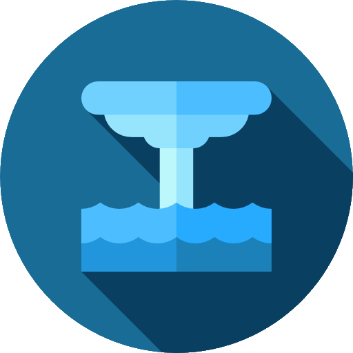

    

<h2 align="center">Geyser</h2>

A light-weight custom css (scss) and js framework for my own projects
  <!--  
  <a href="https://getbootstrap.com/docs/5.1/"><strong>Explore Bootstrap docs »</strong></a>
   
   
  <a href="https://github.com/twbs/bootstrap/issues/new?assignees=-&labels=bug&template=bug_report.yml">Report bug</a>
  ·
  <a href="https://github.com/twbs/bootstrap/issues/new?assignees=&labels=feature&template=feature_request.yml">Request feature</a>
  ·
  <a href="https://themes.getbootstrap.com/">Themes</a>
  ·
  <a href="https://blog.getbootstrap.com/">Blog</a> -->

